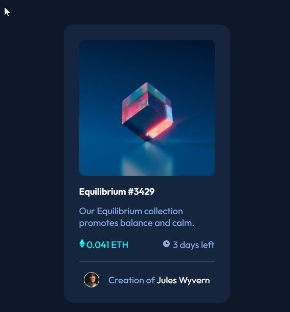
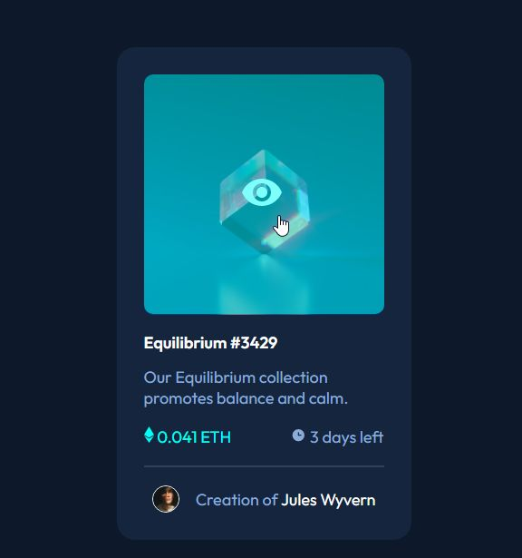
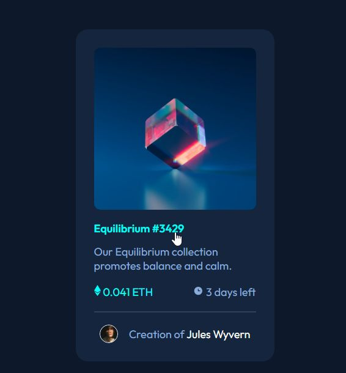
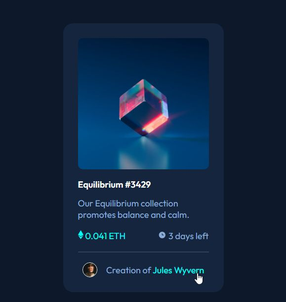

# Frontend Mentor - NFT preview card component solution

This is a solution to the [NFT preview card component challenge on Frontend Mentor](https://www.frontendmentor.io/challenges/nft-preview-card-component-SbdUL_w0U). Frontend Mentor challenges help you improve your coding skills by building realistic projects.

## Table of contents

- [Frontend Mentor - NFT preview card component solution](#frontend-mentor---nft-preview-card-component-solution)
  - [Table of contents](#table-of-contents)
  - [Overview](#overview)
    - [The challenge](#the-challenge)
    - [Screenshots](#screenshots)
    - [Links](#links)
  - [My process](#my-process)
    - [Built with](#built-with)
  - [Author](#author)

## Overview

### The challenge

Users should be able to:

- View the optimal layout depending on their device's screen size
- See hover states for interactive elements

### Screenshots

mobversion

active state 1

active state 2

active state 3

### Links

[check the link to see the project now](https://vasilemidrigan.github.io/nft-preview-card-component/)

## My process

### Built with

- JavaScript eventListeners
- Semantic HTML5 markup
- CSS custom properties
- Flexbox
- CSS Grid
- Mobile-first workflow

## Author

- Website - [Vasile Midrigan](https://vasilemidrigan.github.io/)
- LinkedIn - [Vasile Midrigan](https://www.linkedin.com/in/vasile-midrigan/)
